# Theory of Operation

How the firmware turns a command such as "move axis 3 to 500 steps" into
current in a stepper coil: through trajectory planning, a 1 kHz motion tick,
20 kHz sine microstepping, PWM encoding, and PIO pin toggling fed by DMA.
The end of the document covers every motion mode and the extra features
(groups, PVT, cams, shows, safety, configuration).

Source references are in `firmware/src/`. The diagrams use Mermaid, which
GitHub renders.

---

## 1. Big picture

There are no stepper driver ICs. The RP2350 works out the coil voltages
itself (voltage-mode sine microstepping) and drives cheap AT8833/DRV8833 dual
H-bridges directly, four GPIOs per motor, for up to 10 motors.

The two cores divide the work strictly:

| Core | Job | Timing |
|---|---|---|
| **Core 0** | USB console, binary protocol, I²C target, show player, LEDs, telemetry, flash, buttons, core 1 watchdog | best effort, ~0.5 % idle load |
| **Core 1** | every axis's trajectory, interpolation, amplitude, microstepping, PWM encoding, DMA rings, e-stop ladder | hard real time, ~33–35 % load |

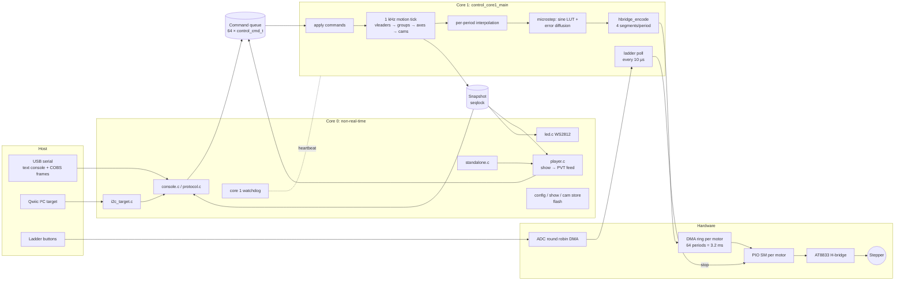

Core 0 never touches motion state directly. It **posts** commands into a
lock-free 64-entry queue (`control_post`, each stamped with a sequence
number) and **reads** state from a snapshot that core 1 publishes every tick
under a sequence lock (`control_snapshot`). Commands report back through
`last_seq` (the last command applied) and `rejected` (commands core 1
refused, such as a move on a grouped axis).

---

## 2. Units and number formats

Everything hinges on one choice of fixed-point position:

```
1 full step          = 2^30 units      (MOTION_UNITS_PER_STEP)
1 electrical cycle   = 4 full steps = 2^32 units
```

Position is an `int64_t`. Its **low 32 bits are exactly the electrical phase**
of the motor, so microstepping needs no conversion: `phase = (uint32_t)pos`.
Wrapping is free, the resolution is about 10⁻⁹ step, and the range is about
8.6 × 10⁹ full steps, so long moves never lose a unit.

Speeds are `float` full steps/s and accelerations full steps/s².

---

## 3. The rate pyramid

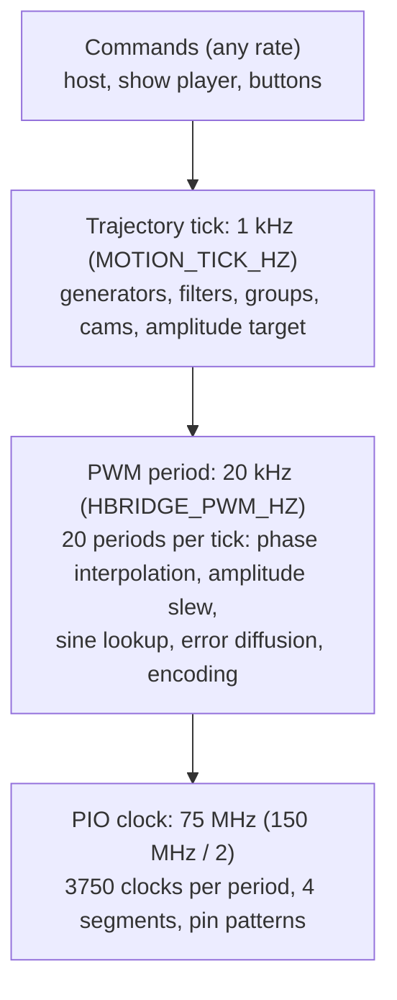

Core 1 doesn't run on a timer interrupt. It runs a tight loop that keeps
every motor's DMA ring full. Each pass:

1. Find `n`, the smallest number of free PWM periods across all rings.
2. For each of those `n` periods:
   * if this is period 0 of a tick (`sub == 0`), run the 1 kHz motion tick;
   * for each motor, compute one PWM period and append it to its ring.

The DMA drains the rings at exactly 20 kHz, so the PWM clock paces the
motion tick. The ring holds 3.2 ms of output, so core 1 can be late by up
to about 3 ms without any glitch at the motor.

---

## 4. Trajectory planning (one axis): `motion.c`

Each axis is a `motion_axis_t`, split into a **raw generator** and an
**output filter**:

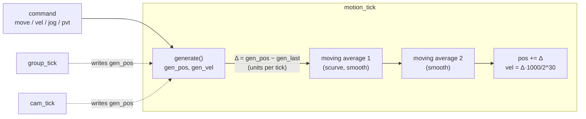

### 4.1 Generators

**Trapezoid, the exact discrete stopping law.** In position mode, every tick
the generator picks the fastest next speed `u` that can still stop exactly
on the target. It solves

```
(v + u)/2 · dt  +  u² / (2a)  ≤  distance remaining
```

for `u`, clamps the result to `vmax`, and moves toward it by at most
`a·dt`. Because this is the discrete law (not the continuous `v = √(2ad)`),
the ramp never overshoots. When a tick would reach the target at a speed it
could stop from in one tick, the generator snaps exactly onto the target.
Retargeting mid-move is free: the next tick simply uses the new distance.

**Velocity and jog** move `gen_vel` toward `cmd_vel` at `amax`. Jog also
counts down a watchdog: if the host doesn't refresh it within the timeout,
`cmd_vel` becomes 0 and the axis ramps to a stop.

**Cosine and quintic (fixed time).** At the start of the move,
`start_segment` picks the shortest duration `T` that respects the limits.
From rest:

| shape | peak v | peak a |
|---|---|---|
| cosine | π/2 · d/T | π²/2 · d/T² |
| quintic (minimum jerk) | 15/8 · d/T | 10/√3 · d/T² |

A quintic retargeted mid-move is re-solved with the current `v₀` and `a₀` as
boundary conditions. `T` is stretched by 15 % per iteration until a sampled
check passes. Each tick advances by Simpson's rule on the velocity (not by
evaluating `x(t)` in float), and every few ticks the generator re-syncs to
the exact double-precision curve, spreading the correction over the next
interval.

### 4.2 S-curve filters

`scurve` and `smooth` don't use a separate jerk-limited planner. They run the
trapezoid's **per-tick position deltas** through one or two moving averages
of length `Tj` (`jerk_ms`, up to 100 ms):

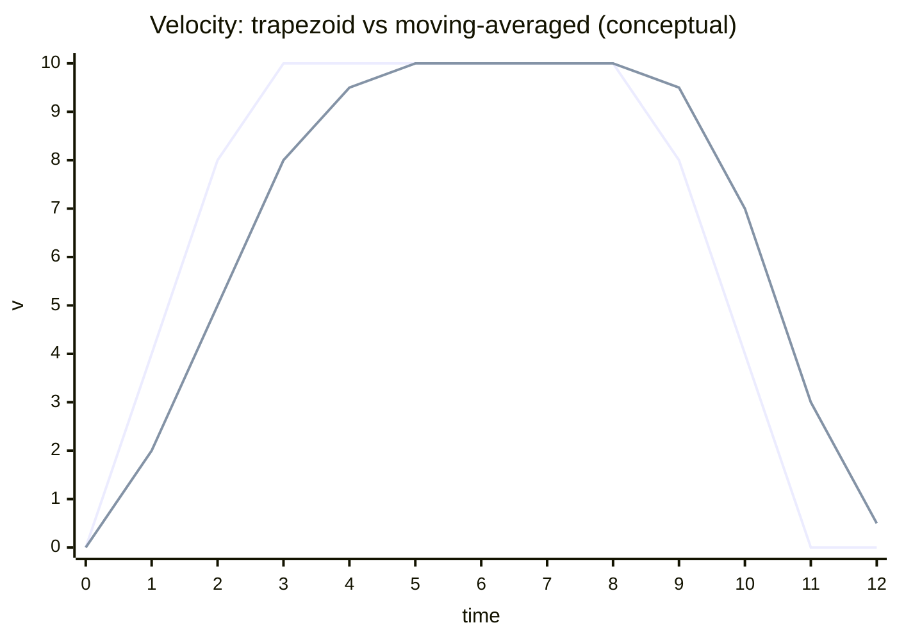

* One stage turns each step in acceleration into a ramp: jerk = `amax / Tj`.
* Two stages make the jerk itself continuous.
* Averaging never raises peak speed or acceleration.
* The integer remainder of each division is **carried**, so the filtered
  total equals the input total exactly: the output lands on the target to
  the unit.

The cost is a lag of `Tj` per stage. An axis counts as `settled` only once
the generator is idle **and** the filters have flushed. Profile changes are
accepted only while settled.

PVT and cam followers set `unfiltered` and bypass the filters, because their
input is already smooth and a lag would break their timing.

---

## 5. Core 1 motion tick ordering

Order matters, because some axes read others' positions in the same tick:

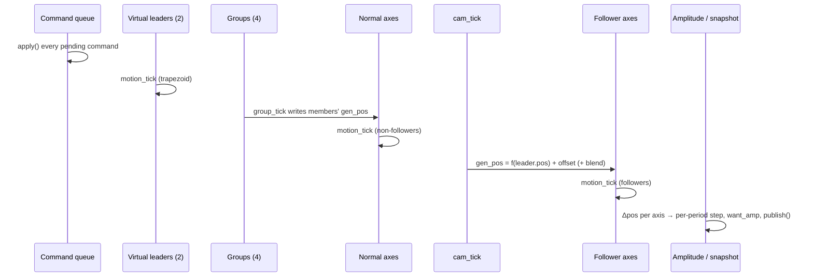

---

## 6. From a 1 ms tick to 20 PWM periods: interpolation

After the tick, each axis has moved `Δ = pos_now − pos_before` units. That
movement is spread evenly over the next 20 PWM periods:

```
q     = Δ / 20            (64-bit: Δ can exceed 2^31 above ~2000 steps/s)
rem   = Δ − 20q
step  = q, plus ±1 for the first |rem| periods
```

so after 20 periods the electrical phase has advanced by **exactly** Δ. The
microstep phase therefore never drifts from the trajectory position, and on
an e-stop clear it is resynced with `phase = (uint32_t)pos`.

The result is piecewise-linear phase at 20 kHz, which follows the 1 kHz
trajectory with sub-microstep resolution.

---

## 7. Drive amplitude (voltage-mode current control)

With no current sensing, the coil current is set by the PWM **amplitude**, a
0..1 fraction of the full duty span. Each tick computes a target:

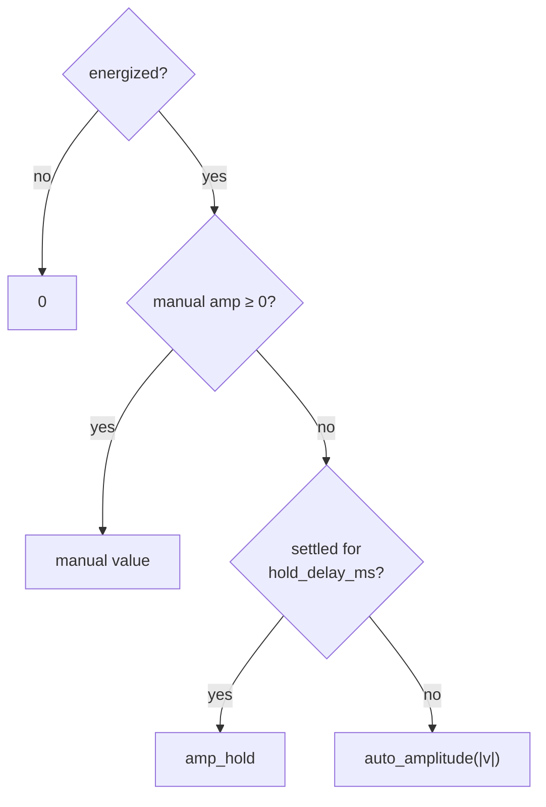

```
amp
 ^          amp_high ________
 |                  /
 |                 /   (linear: makes up for back-EMF)
 | amp_low _______/
 +----------------+------+-------> |speed|
              low_speed  high_speed
```

Standstill heats the coils most, so after the hold delay the axis drops to
`amp_hold`. At each PWM period the actual amplitude slews toward the target
at 2.0 per second (`AMP_SLEW_PER_SEC`), so run/hold changes don't jerk the
rotor.

---

## 8. Sine microstepping: `microstep.c`

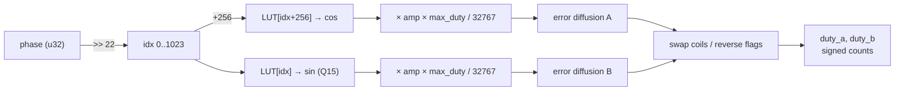

* **Lookup table:** 1024 entries per electrical cycle, which is 256 entries
  per full step (1/256 microstepping). Coil A gets cosine and coil B gets
  sine, a quarter cycle apart. The table is generated offline
  (`tools/gen_sine_lut.py`) because the SDK's `sinf` misbehaved near
  multiples of π/2 on the RP2350.
* **Error diffusion:** the exact duty is fractional, and the driver swallows
  pulses shorter than ~450 ns. Each coil keeps a `carry`: rounding residue,
  and any duty below `min_duty` (500 ns ≈ 38 counts), are added to the next
  period instead. The **average** duty therefore matches the request even
  near the zero crossings, where a naive driver would produce a dead zone.
* **Wiring fixes:** `SWAP_COILS` exchanges A and B, and `REVERSE` negates B
  (which reverses rotation).

---

## 9. PWM encoding: `hbridge_encode.c`

At 150 MHz / 2 the PIO runs at 75 MHz, so a 20 kHz period is **3750 SM
clocks**. Each period is four segments, and each segment is a 16-bit
half-word:

```
bits [3:0]   pin pattern: AIN1 AIN2 BIN1 BIN2
bits [15:4]  length L; the segment lasts L + 3 clocks
```

The usable span is `3750 − 4×3 = 3738` counts per coil. For signed duties
`a` and `b`:

```
|<-- min(|a|,|b|) -->|<-- |hi|-|lo| -->|<----- rest/2 ----->|<----- rest/2 ----->|
 both coils driven     longer coil only     both braked           both braked
 (seg 1)               (seg 2)              (seg 3)               (seg 4)
```

| Pattern | Meaning |
|---|---|
| `xIN1=1, xIN2=0` | forward drive |
| `xIN1=0, xIN2=1` | reverse drive |
| `xIN1=1, xIN2=1` | **brake** (slow decay: both low-side FETs on, coil current recirculates) |

The off-time is brake (slow decay) rather than coast, which gives smoother
current at low duty. The brake time is split in two segments only so each
length fits in 12 bits.

The two half-words of segments 1–2 form word 0, and segments 3–4 form
word 1: **two 32-bit words per period per motor**.

---

## 10. DMA rings and the PIO program: IO toggling

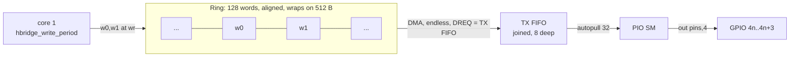

The PIO program is three instructions:

```
.wrap_target
    out pins, 4      ; set AIN1 AIN2 BIN1 BIN2 for this segment
    out x, 12        ; segment length
seg_loop:
    jmp x-- seg_loop ; wait L+1 clocks (plus 2 for the outs = L+3)
.wrap
```

* **One state machine per motor:** motors 0–3 on PIO0, 4–7 on PIO1, 8–9 on
  PIO2. All SMs in a block start with `pio_enable_sm_mask_in_sync`, so the
  periods stay phase-aligned.
* **The DMA** runs in endless mode with ring wrap (`channel_config_set_ring`,
  9 address bits = 512 B), paced by the SM's TX FIFO DREQ. It replays the
  ring forever, and core 1 only has to stay ahead of the read pointer
  (`hbridge_free_periods`, with one period of slack).
* **Fail safe:** if the FIFO ever runs dry, the SM stalls holding its last
  pattern. The encoder always ends a period with brake, so a stall leaves
  both coils shorted, with no drive.
* `hbridge_safe_off` aborts the DMA, stops the SM, and hands the pins to SIO
  driven low (coast). It is used by the e-stop and the core 1 watchdog,
  because a stalled producer would otherwise leave the ring replaying stale
  periods.

### End-to-end timing of one period

```mermaid
gantt
    dateFormat X
    axisFormat %s
    title One 50 µs PWM period (|a| = 2000, |b| = 800 of 3738)
    section Coil A
    drive        :a1, 0, 2003
    brake        :a2, after a1, 3750
    section Coil B
    drive        :b1, 0, 803
    brake        :b2, after b1, 3750
```

---

## 11. Motion modes

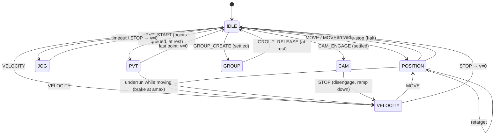

| Mode | What drives `gen_pos` | Notes |
|---|---|---|
| `IDLE` | nothing | holds; drops to hold amplitude after `hold_delay_ms` |
| `POSITION` | trapezoid stop law, or a cosine/quintic segment | retargetable mid-move, lands exactly |
| `VELOCITY` | ramp to `cmd_vel` at `amax` | `STOP` ramps to 0 |
| `JOG` | as velocity, plus a timeout | stops unless refreshed (default 300 ms from the console) |
| `PVT` | cubic Hermite between streamed points | queue of 32 per axis; underrun → safe brake |
| `GROUP` | `group_tick` | individual motion commands refused; `STOP` stops the group |
| `CAM` | `cam_tick`: `f(leader)` | motion commands refused; `STOP` disengages |

### Profiles (per axis)

| Profile | Generator | Filter | Use |
|---|---|---|---|
| `trap` | stop law | none | fastest, step changes in acceleration |
| `scurve` (default, Tj 30 ms) | stop law | 1 moving average | limited jerk |
| `smooth` | stop law | 2 moving averages | continuous jerk |
| `cosine` | fixed-time cosine | none | smooth, symmetric moves from rest |
| `quintic` | minimum-jerk quintic | none | smoothest point to point; retargets with v₀ and a₀ |

---

## 12. Coordinated groups: `group.c`

A group (up to 4) owns a set of axes and moves them along a queue of up to
32 straight **joint-space segments**, so every member starts and finishes
each segment together.

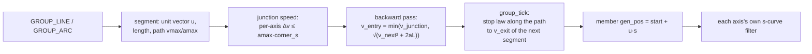

* **Path limits:** the segment's path `vmax`/`amax` is the largest value for
  which no member exceeds its own limits (scaled by its share of `u`).
* **Corners:** the junction speed is capped so that no axis's speed changes
  by more than `amax × corner_s` across the corner.
* **Lookahead:** after every append the queue is re-planned backward, so the
  group can always stop by the end of what it has been given.
* **Execution** uses the same discrete stop law as a single axis, but toward
  the next segment's entry speed. Segments end exactly on their integer
  targets, and leftover travel carries into the next segment.
* **Arcs** (members 0 and 1) are fed in as chords, sized so no chord strays
  further than `tol` from the true circle. Chords are added lazily as the
  queue drains, so an arc of any length fits, and the last point is exact.
* **Hold/resume** decelerates along the path and waits. **Stop** holds, then
  drops the queue once at rest.

---

## 13. Streamed PVT

The host sends `(pos, vel, Δt)` points. Each axis follows a cubic Hermite
between them, landing exactly on each knot position and speed.
`PVT_START` starts only from rest, so several axes can start on the same
tick. If the queue runs dry while moving, the axis brakes at `amax` and
counts an **underrun** (reported as an event). PVT bypasses the s-curve
filters.

---

## 14. Electronic cams and virtual leaders

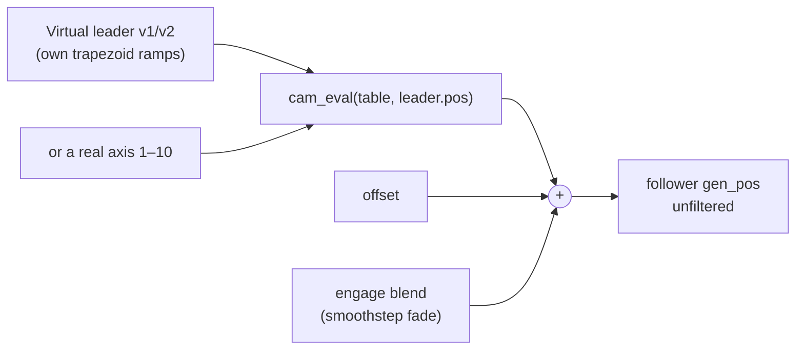

* A **table** holds up to 128 `(x, y)` points in full steps, joined by cubic
  Hermite segments with Catmull-Rom slopes, so it is C¹ and the follower's
  speed is continuous.
* **Cyclic** tables repeat with period `X`, and their net rise `R`
  accumulates each cycle (`R ≠ 0` advances the follower every revolution).
  Cycles are counted in exact integer units, so millions of cycles don't
  drift. **One-shot** tables hold their end values.
* Following is by **position**, so a follower retraces exactly when the
  leader reverses, at any speed.
* **Engage:** core 0 first checks (`cam_check`) that the follower can keep up
  with `v_f = y′·v_l` and `a_f = y″·v_l² + y′·a_l` at the leader's limits.
  This check is too slow for the 1 ms tick, so it doesn't run on core 1.
  Core 1 then fades out the initial position difference over `blend_ms`
  with a smoothstep.
* Two **virtual leaders** are pure trajectory generators with no motor:
  velocity, move, stop, limits and zero.
* There are 4 table slots. Tables are saved in flash by `save` and restored
  at boot.

---

## 15. Shows and the player

A **show** is a binary blob (compiled from JSON by `tools/stepperctl`) with
keyframe tracks for axes and LED pixels on one timeline. It is stored in one
of 4 flash slots, validated with a CRC and checked against the axes' limits.

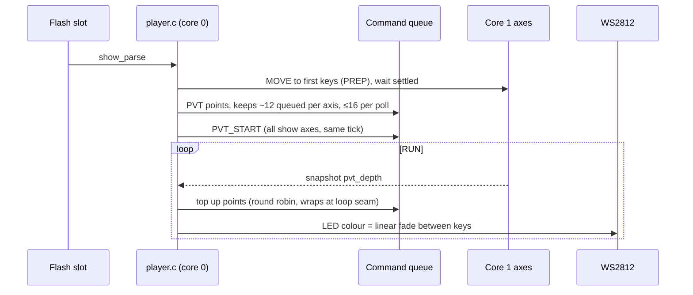

Axis keys become PVT points, so motion passes exactly through every key.
Automatic speeds come from the neighbouring keys, with zero at the ends of a
non-looping show.

---

## 16. Safety

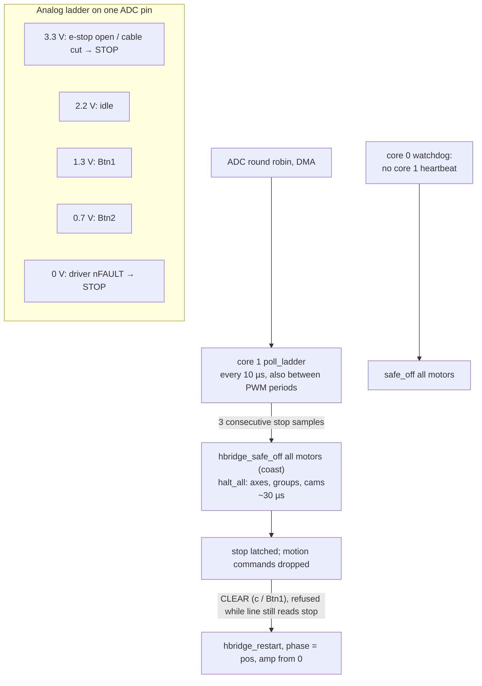

* **Stop latency** is about 30 µs. The ladder is also polled inside the
  per-period loop, not just once per tick.
* **A held button can hide an open e-stop:** e-stop open + Btn1 reads
  1.65 V and e-stop open + Btn2 reads 0.82 V, both inside the button bands.
  The 1.49–1.76 V band, held for 5 ms, latches an e-stop. Btn2's case is too
  close to Btn2 alone to split, so any button held longer than 3 s latches
  an e-stop (this also catches a stuck button). Neither counts as a press,
  and the stop can't be cleared until the line is back to idle.
* **Core 1 watchdog:** core 0 watches `control_heartbeat`. If it stops (and
  no flash write is in progress), all outputs go to coast.
* **PIO starvation** fails to brake, as described in section 10.
* **Power-up:** the outputs run at zero amplitude until V5 has settled, then
  `control_energized` lets amplitude ramp up at the slew limit.
* **Flash writes** (config, shows, cams) pause core 1 safely through
  `flash_safe_execute`, and only with all axes at rest.

---

## 17. Configuration and persistence

| Item | Where |
|---|---|
| per-axis vmax, amax, profile, jerk_ms | `config_t`, two alternating flash sectors, generation counter + CRC-32 |
| drive curve (amp_low/high/hold, low/high speed), reverse, swap coils | `config_t` |
| hold delay, boot show | `config_t` |
| shows | 4 slots (`show_store.c`) |
| cam tables | `cam_store.c`, saved by `save` |

An interrupted save leaves the previous record valid. At load, the newest
valid record wins.

---

## 18. Interfaces

* **USB text console:** human commands (`m`, `j`, `g`, `gl`, `ga`, `p`, `cam`,
  `ce`, `vl`, `t`, `drive`, `save`, ...). Type `help`.
* **USB binary protocol:** COBS frames delimited by `0x00`, CRC-16. Frames
  share the port with the console, and every request is ACKed with the core 1
  sequence number (spec in `protocol.h`, client in `tools/stepperctl`).
* **I²C target** (Qwiic, address 0x42, RP2354B board): the same requests
  without framing. Untested.
* **Telemetry:** up to 1 kHz, numbered lines, with selectable axes and fields,
  plus events (done, underrun, e-stop, fault, clear).
* **Standalone mode:** a boot show starts at power-up. Btn1 clears a stop or
  starts/stops the show, and Btn2 selects the next show.
* **Status LEDs:** pixel 0 shows overall status (fault, watchdog, bypass),
  and pixels 1–10 show each axis's speed and direction.

---

## 19. Summary: life of one microstep

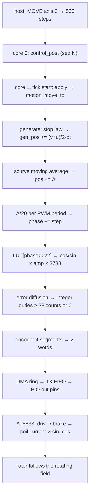
